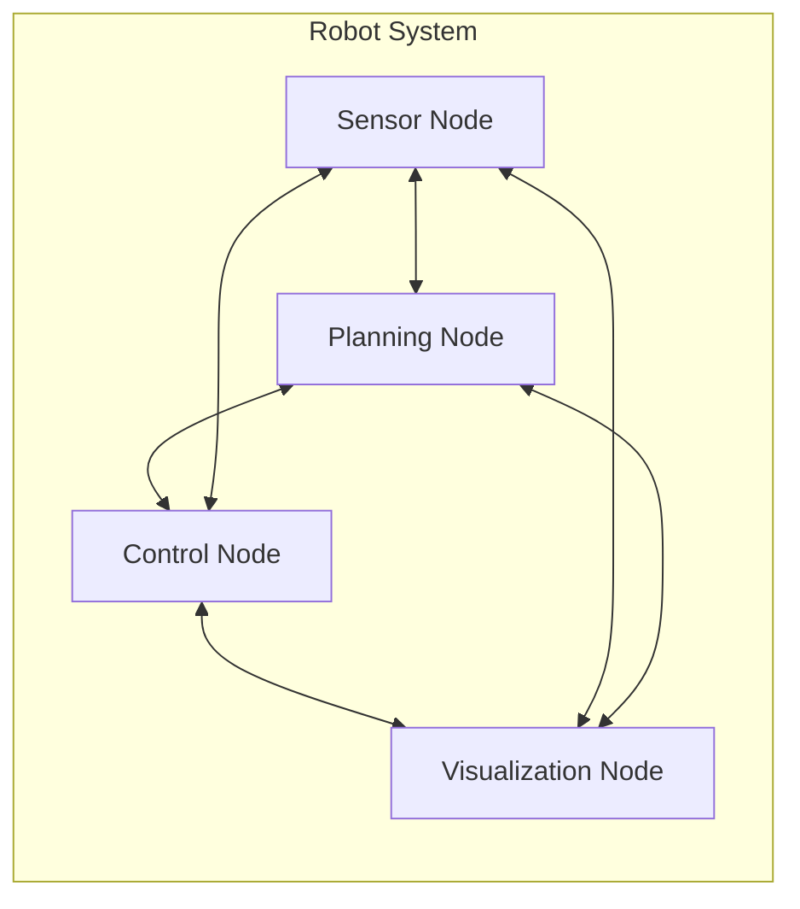

# Distributed Communication Overview

## Understanding Distributed Systems in Robotics

Distributed systems are collections of independent computers that appear to users as a single coherent system. In robotics, distributed communication refers to the mechanisms that allow different components of a robot (or multiple robots) to communicate and coordinate with each other, even when they are running on different hardware, processors, or network nodes.

## Characteristics of Distributed Communication in ROS 2

### Decentralized Architecture
Unlike ROS 1's centralized master architecture, ROS 2 uses a decentralized approach where nodes discover each other directly. This eliminates the single point of failure and enables more robust robot systems.



### Communication Patterns
ROS 2 supports several communication patterns:

#### Publish-Subscribe (Topics)
- Asynchronous, one-to-many communication
- Publishers send messages without knowledge of subscribers
- Subscribers receive messages without knowledge of publishers
- Implemented using DDS DataWriters and DataReaders

#### Request-Response (Services)
- Synchronous, one-to-one communication
- Client sends a request and waits for a response
- Server processes requests and sends responses
- Blocking communication until response is received

#### Action Communication
- Asynchronous, goal-oriented communication
- Client sends a goal, receives feedback during execution, and gets a result
- Server executes goals and provides feedback
- Supports cancellation and status reporting

## How Distributed Communication Works in ROS 2

### Discovery Process
1. **Domain Participant Creation**: Each node creates a DomainParticipant to join a DDS domain
2. **Participant Discovery**: Nodes discover each other using the DDS discovery protocol
3. **Topic Matching**: Publishers and subscribers match on topic names and types
4. **QoS Negotiation**: Communication parameters are negotiated based on QoS policies

### Message Transport
- **Intra-process**: Within the same process, messages are passed by reference
- **Inter-process**: Between processes on the same machine, typically using shared memory
- **Network**: Between different machines, using TCP or UDP with the RTPS protocol

## Benefits of Distributed Communication

### Scalability
- Components can be distributed across multiple machines
- Load can be balanced across different processing units
- Systems can grow by adding new nodes without changing existing ones

### Fault Tolerance
- Failure of one node doesn't necessarily affect others
- Redundant nodes can take over functions of failed nodes
- Isolation prevents cascading failures

### Flexibility
- Components can be developed and maintained independently
- Different programming languages can be used for different nodes
- Hardware can be upgraded or replaced without affecting the entire system

### Performance
- Computation can be distributed to appropriate hardware
- Communication can be optimized based on requirements
- Parallel processing of different robot functions

## Challenges in Distributed Communication

### Network Latency
Communication across networks introduces delays that must be considered in real-time systems. ROS 2 addresses this through QoS policies that can prioritize time-critical communications.

### Message Ordering
In distributed systems, there's no guarantee of message ordering. ROS 2 provides QoS policies to control ordering requirements when needed.

### Consistency
Maintaining consistent state across distributed nodes requires careful design and coordination. This is particularly important in multi-robot systems.

### Security
Distributed systems are more vulnerable to security threats. ROS 2 includes security features based on DDS Security specifications.

## Real-World Examples

### Single Robot with Distributed Processing
```
Sensors (Raspberry Pi) -> Perception (GPU Computer) -> Planning (Main Computer) -> Control (Microcontroller)
```

### Multi-Robot System
```
Robot 1: [Navigation] --[Coordination]--> [Task Management] <--[Coordination]-- Robot 2: [Mapping]
```

### Cloud Robotics Integration
```
Local Robot: [Sensors] -> [Edge Processing] -> [Cloud Services: AI/ML] -> [Local Control]
```

## Quality of Service (QoS) in Distributed Communication

QoS policies allow fine-tuning communication behavior for different use cases:

- **Reliability**: Ensures message delivery for critical data (e.g., safety commands)
- **Durability**: Maintains message history for late-joining nodes (e.g., state information)
- **Deadline**: Guarantees timing requirements (e.g., control loops)
- **Liveliness**: Monitors node health and availability

## Best Practices for Distributed Communication

1. **Design for Failure**: Assume components will fail and design accordingly
2. **Minimize Network Traffic**: Only send necessary data at required frequencies
3. **Consider Latency**: Account for communication delays in real-time systems
4. **Use Appropriate QoS**: Match QoS policies to application requirements
5. **Secure Communications**: Implement security when required
6. **Monitor Performance**: Track communication performance and reliability

## References

<div class="reference-list">

- Coulouris, G., Dollimore, J., Kindberg, T., & Blair, G. (2019). Distributed systems: concepts and design (6th ed.). Pearson Education Limited.
- Fielding, R. T. (2000). Architectural styles and the design of network-based software architectures. University of California, Irvine.
- Lee, E. A. (2006). The problem with threads. *Computer*, 39(5), 33-42.

</div>