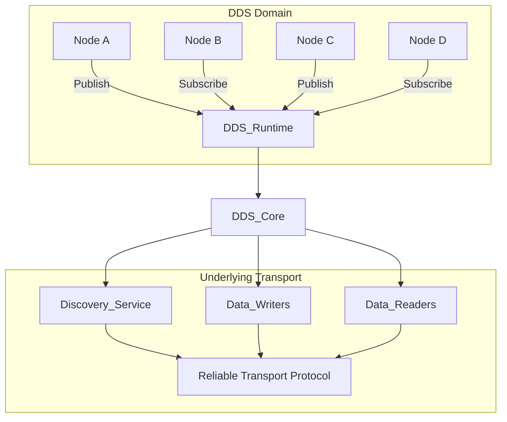

# DDS and Middleware Concepts

## Introduction to Middleware

Middleware is software that provides common services and capabilities to applications beyond what's offered by the operating system. In the context of robotics, middleware serves as the communication infrastructure that allows different software components to interact with each other, regardless of their location, programming language, or underlying operating system.

## Data Distribution Service (DDS)

Data Distribution Service (DDS) is a specification developed by the Object Management Group (OMG) that defines a standard for distributed, real-time data exchange. ROS 2 uses DDS as its underlying communication layer, which provides several key advantages:

- **Decentralized Architecture**: No single point of failure as in ROS 1's master-based system
- **Language and Platform Independence**: Supports multiple programming languages and operating systems
- **Quality of Service (QoS) Controls**: Configurable policies for reliability, durability, and other communication characteristics
- **Real-time Support**: Deterministic behavior for time-critical applications
- **Security**: Built-in support for authentication, encryption, and access control

## DDS Architecture

### Core DDS Concepts

#### DDS Domain
A DDS domain is a communication plane that isolates DDS applications from each other. Each domain is identified by a unique domain ID, and applications within the same domain can communicate with each other.

#### DDS Entities
- **DomainParticipant**: The entry point for an application to access DDS services
- **Publisher**: Manages a collection of DataWriters
- **Subscriber**: Manages a collection of DataReaders
- **DataWriter**: Publishes data samples to the domain
- **DataReader**: Subscribes to data samples from the domain
- **Topic**: Defines the data type and name for communication

## Quality of Service (QoS) Policies

DDS provides a rich set of QoS policies that allow fine-tuning of communication behavior:

### Reliability
- **Reliable**: Guarantees delivery of all samples (like TCP)
- **Best Effort**: No guarantee of delivery (like UDP)

### Durability
- **Transient**: Historical data is available to late-joining subscribers
- **Volatile**: Only new data is available to subscribers

### History
- **Keep All**: Stores all samples until resource limits are reached
- **Keep Last**: Stores only the most recent samples

### Deadline
Defines the maximum time between sample publications for a topic.

### Lifespan
Defines the maximum lifetime of a sample after it is written.

## Middleware in Robotics Context

In robotics, middleware like DDS provides several critical capabilities:

### Decoupling
Middleware decouples the temporal and spatial aspects of communication:
- **Temporal decoupling**: Publishers and subscribers don't need to be active simultaneously
- **Spatial decoupling**: Publishers and subscribers don't need to know each other's location

### Data-Centricity
DDS is data-centric, meaning communication is based on the data itself rather than on the location of the data. This enables:
- Automatic data distribution to all interested parties
- Historical data access
- Efficient multicast communication

### Scalability
The distributed nature of DDS allows for scaling from single robots to multi-robot systems without architectural changes.

## DDS Implementations in ROS 2

ROS 2 supports multiple DDS implementations, including:
- **Fast DDS** (formerly Fast RTPS) - Developed by eProsima
- **Cyclone DDS** - Developed by Eclipse Foundation
- **RTI Connext DDS** - Commercial implementation by RTI
- **OpenSplice DDS** - Open-source implementation

Each implementation provides the same DDS API but may have different performance characteristics, licensing terms, and feature sets.

## Comparison with Traditional Approaches

| Aspect | Traditional ROS 1 | DDS-based ROS 2 |
|--------|-------------------|------------------|
| Architecture | Centralized (master) | Decentralized |
| Communication | TCPROS/UDPROS | DDS with QoS |
| Multi-robot | Complex setup required | Native support |
| Security | Limited | Built-in support |
| Real-time | Limited | Native support |

## References

- Object Management Group. (2015). *Data Distribution Service (DDS) for Real-Time Systems, Version 1.4*. OMG.
- Pardo-Castellote, G. (2003). OMG DDS: The new standard for distributed publish/subscribe. *Object Management Group*, 1-16.
- Chen, I. R., & Ahmed, F. (2012). Message reliability in robot communication middleware. *Proceedings of the IEEE International Conference on Robotics and Automation*, 2968-2973.

