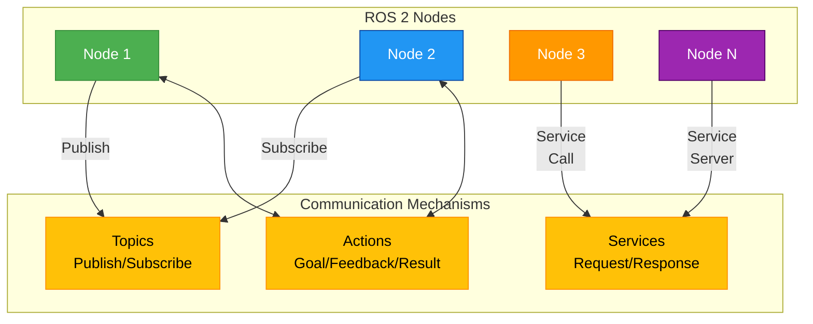

# ROS 2 Communication Patterns Overview

This diagram shows the different communication patterns available in ROS 2. Nodes can communicate using topics for asynchronous messaging, services for synchronous request-response, and actions for long-running tasks with feedback.