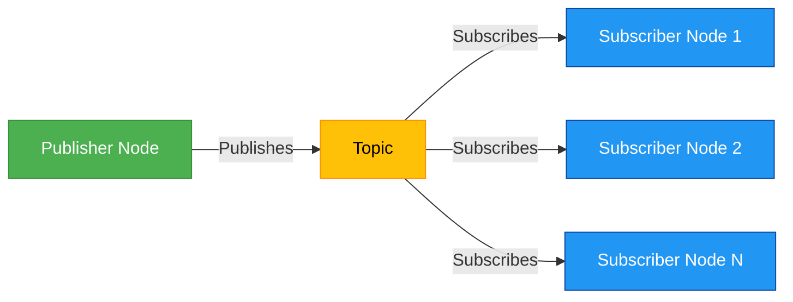

# Publisher/Subscriber Communication Pattern

The publisher/subscriber pattern allows for asynchronous communication where publishers send messages to topics without knowing which subscribers will receive them. Multiple subscribers can listen to the same topic, enabling broadcast communication.