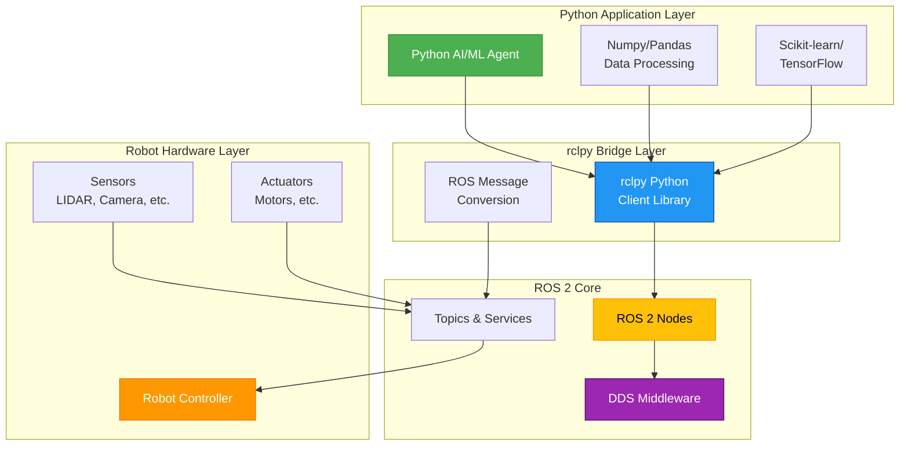

# Python-ROS Integration Architecture

This diagram illustrates how Python-based AI agents connect to ROS 2 systems through the rclpy client library, enabling integration between Python AI/ML ecosystems and robotic hardware systems.