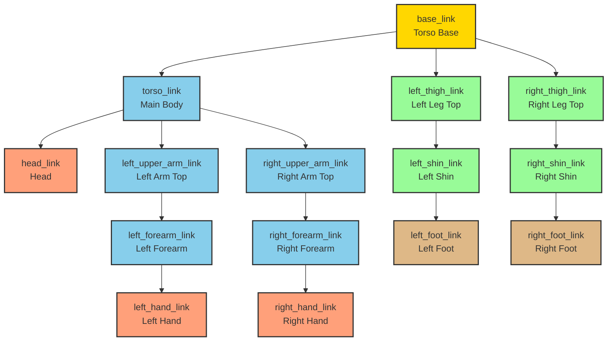

# Humanoid Robot Structure Diagram

This diagram shows the kinematic structure of the minimal humanoid robot, with the base link at the center connecting to all major body parts: torso (with head and arms) and legs. Each link is labeled with its name and function.